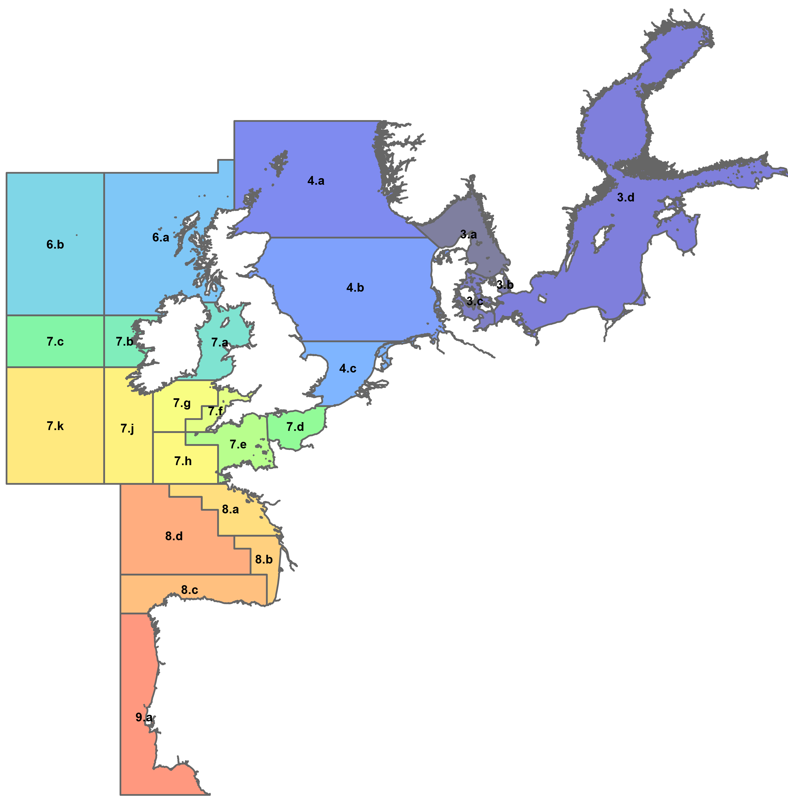
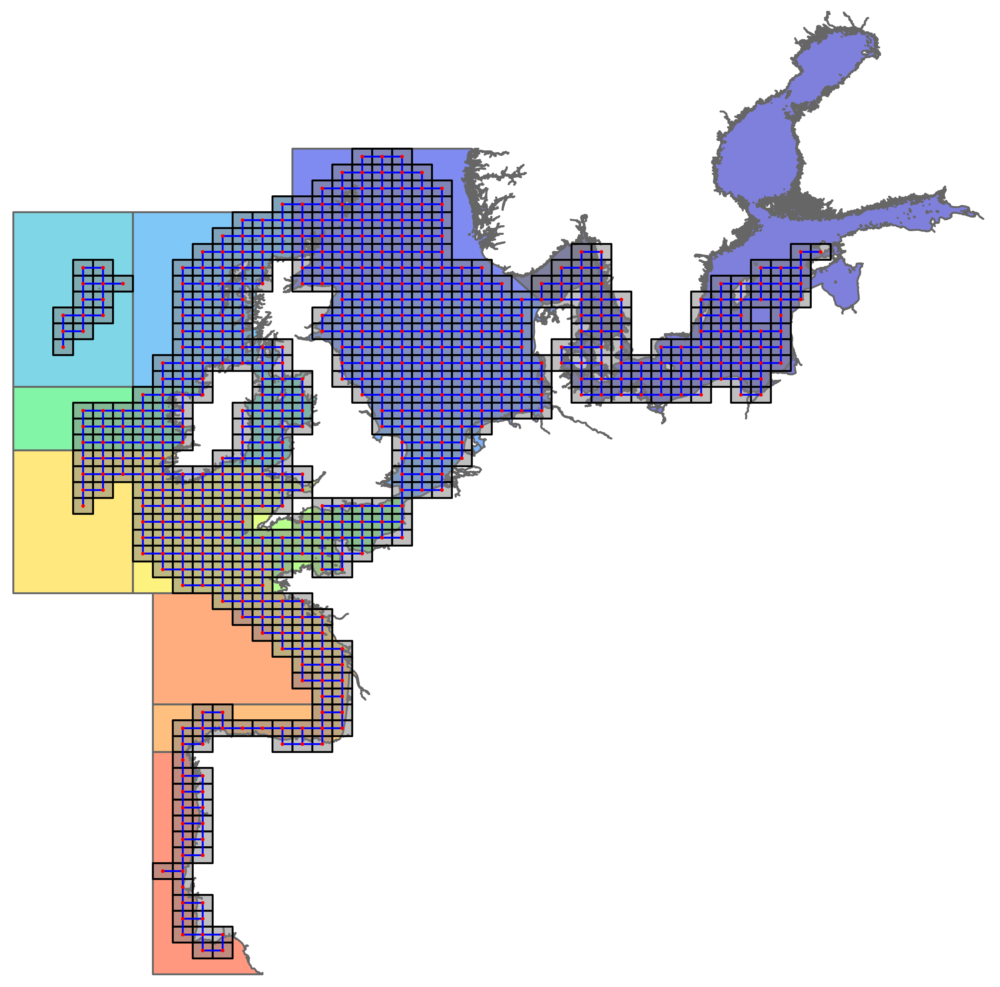

```{r setup, include=FALSE}
knitr::opts_chunk$set(echo = TRUE, cache = TRUE)
knitr::opts_knit$set(root.dir = normalizePath('../'))
```

```{r load, include=FALSE, message=FALSE}
# load packages etc.
source("scripts/header.R")
load("input/spatial_model_data.rData")
```

```{r functions, include=FALSE}
# plot result
plot_result <- function(res, main = "") {

  xy <- coordinates(area)
  # relocate center of 3.d for plotting
  #xy["3.d",] <- unlist(locator(n=1))
  xy["3.d",] <- c(16.26910, 54.85013)

  # get coords of arrows and lines
  x0 = xy[ifelse(res$slope > 0, res$Division1, res$Division2),1]
  y0 = xy[ifelse(res$slope > 0, res$Division1, res$Division2),2]
  x1 = xy[ifelse(res$slope > 0, res$Division2, res$Division1),1]
  y1 = xy[ifelse(res$slope > 0, res$Division2, res$Division1),2]

  plot(area, border = grey(0.5, alpha = 0.5), main = main)
  segments(x0, y0, x1, y1,
           col = "blue", lwd = 1)
  
  # shorten arrow
  arrows(x0, y0, x0+(x1-x0)*.45, y0 + (y1-y0)*.45,
         col = "blue", lwd = 2,
         code = 2, length = 0.1)
  points(xy, pch = 16, col = "red", cex = 0.8)
}
```

## TAC units



Figure 1. A figure showing the size and location of the TAC units under consideration.  Each unit is uniquely coloured to distinguish it and the name of each unit is shown in its centre.

## Data coverage



Figure 2. Overlayed on the TAC units is the spatial extent considered for the assessment of changes in distribution between stock areas.  For example, Division 8.d is represented by 3 statistical rectangles traversing the shelf edge, and 7.k is represented by 9 statistical rectangles in the north eastern corner covering approximately 25\% of the area defined by 7.k. Other regions are more completley covered, such as, 4.a and 4.b. 

## Megrim

```{r megrim, results="asis", echo=FALSE}
load("output/Megrim_trends.rData")
res %<>% filter(p_adj < 0.05) %>% select(-p)
knitr::kable(res, digits = 3)
```

```{r megrim_plot, dpi=600, fig.width=7, fig.height=7, echo=FALSE}
plot_result(res, main = "Megrim")
```


## Plaice

```{r Plaice, results="asis", echo=FALSE}
load("output/Plaice_trends.rData")
res %<>% filter(p_adj < 0.05) %>% select(-p)
knitr::kable(res, digits = 3)
```

```{r Plaice_plot, dpi=600, fig.width=7, fig.height=7, echo=FALSE}
plot_result(res, main = "Plaice")
```


## Sole

```{r Sole, results="asis", echo=FALSE}
load("output/Sole_trends.rData")
res %<>% filter(p_adj < 0.05) %>% select(-p)
knitr::kable(res, digits = 3)
```

```{r Sole_plot, dpi=600, fig.width=7, fig.height=7, echo=FALSE}
plot_result(res, main = "Sole")
```


## Anchovy

```{r Anchovy, results="asis", echo=FALSE}
load("output/Anchovy_trends.rData")
res %<>% filter(p_adj < 0.05) %>% select(-p)
knitr::kable(res, digits = 3)
```

```{r Anchovy_plot, dpi=600, fig.width=7, fig.height=7, echo=FALSE}
plot_result(res, main = "Anchovy")
```


## Anglerfish

```{r Anglerfish, results="asis", echo=FALSE}
load("output/Anglerfish_trends.rData")
res %<>% filter(p_adj < 0.05) %>% select(-p)
knitr::kable(res, digits = 3)
```

```{r Anglerfish_plot, dpi=600, fig.width=7, fig.height=7, echo=FALSE}
plot_result(res, main = "Anglerfish")
```


## Blue Whiting

```{r Blue_Whiting, results="asis", echo=FALSE}
load("output/Blue Whiting_trends.rData")
res %<>% filter(p_adj < 0.05) %>% select(-p)
knitr::kable(res, digits = 3)
```

```{r Blue_Whiting_plot, dpi=600, fig.width=7, fig.height=7, echo=FALSE}
plot_result(res, main = "Blue Whiting")
```


## Cod

```{r Cod, results="asis", echo=FALSE}
load("output/Cod_trends.rData")
res %<>% filter(p_adj < 0.05) %>% select(-p)
knitr::kable(res, digits = 3)
```

```{r Cod_plot, dpi=600, fig.width=7, fig.height=7, echo=FALSE}
plot_result(res, main = "Cod")
```


## Haddock

```{r Haddock, results="asis", echo=FALSE}
load("output/Haddock_trends.rData")
res %<>% filter(p_adj < 0.05) %>% select(-p)
knitr::kable(res, digits = 3)
```

```{r Haddock_plot, dpi=600, fig.width=7, fig.height=7, echo=FALSE}
plot_result(res, main = "Haddock")
```


## Hake

```{r Hake, results="asis", echo=FALSE}
load("output/Hake_trends.rData")
res %<>% filter(p_adj < 0.05) %>% select(-p)
knitr::kable(res, digits = 3)
```

```{r Hake_plot, dpi=600, fig.width=7, fig.height=7, echo=FALSE}
plot_result(res, main = "Hake")
```


## Herring

```{r Herring, results="asis", echo=FALSE}
load("output/Herring_trends.rData")
res %<>% filter(p_adj < 0.05) %>% select(-p)
knitr::kable(res, digits = 3)
```

```{r Herring_plot, dpi=600, fig.width=7, fig.height=7, echo=FALSE}
plot_result(res, main = "Herring")
```


## Horse Mackerel

```{r Horse_Mackerel, results="asis", echo=FALSE}
load("output/Horse Mackerel_trends.rData")
res %<>% filter(p_adj < 0.05) %>% select(-p)
knitr::kable(res, digits = 3)
```

```{r Horse_Mackerel_plot, dpi=600, fig.width=7, fig.height=7, echo=FALSE}
plot_result(res, main = "Horse Mackerel")
```


## Mackerel

```{r Mackerel, results="asis", echo=FALSE}
load("output/Mackerel_trends.rData")
res %<>% filter(p_adj < 0.05) %>% select(-p)
knitr::kable(res, digits = 3)
```

```{r Mackerel_plot, dpi=600, fig.width=7, fig.height=7, echo=FALSE}
plot_result(res, main = "Mackerel")
```


## Norway Pout

```{r Norway_Pout, results="asis", echo=FALSE}
load("output/Norway Pout_trends.rData")
res %<>% filter(p_adj < 0.05) %>% select(-p)
knitr::kable(res, digits = 3)
```

```{r Norway_Pout_plot, dpi=600, fig.width=7, fig.height=7, echo=FALSE}
plot_result(res, main = "Norway Pout")
```


## Pollack

```{r Pollack, results="asis", echo=FALSE}
load("output/Pollack_trends.rData")
res %<>% filter(p_adj < 0.05) %>% select(-p)
knitr::kable(res, digits = 3)
```

```{r Pollack_plot, dpi=600, fig.width=7, fig.height=7, echo=FALSE}
plot_result(res, main = "Pollack")
```


## Saithe

```{r Saithe, results="asis", echo=FALSE}
load("output/Saithe_trends.rData")
res %<>% filter(p_adj < 0.05) %>% select(-p)
knitr::kable(res, digits = 3)
```

```{r Saithe_plot, dpi=600, fig.width=7, fig.height=7, echo=FALSE}
plot_result(res, main = "Saithe")
```


## Spurdog

```{r Spurdog, results="asis", echo=FALSE}
load("output/Spurdog_trends.rData")
res %<>% filter(p_adj < 0.05) %>% select(-p)
knitr::kable(res, digits = 3)
```

```{r Spurdog_plot, dpi=600, fig.width=7, fig.height=7, echo=FALSE}
plot_result(res, main = "Spurdog")
```


## Sprat

```{r Sprat, results="asis", echo=FALSE}
load("output/Sprat_trends.rData")
res %<>% filter(p_adj < 0.05) %>% select(-p)
knitr::kable(res, digits = 3)
```

```{r Sprat_plot, dpi=600, fig.width=7, fig.height=7, echo=FALSE}
plot_result(res, main = "Sprat")
```


## Whiting

```{r Whiting, results="asis", echo=FALSE}
load("output/Whiting_trends.rData")
res %<>% filter(p_adj < 0.05) %>% select(-p)
knitr::kable(res, digits = 3)
```

```{r Whiting_plot, dpi=600, fig.width=7, fig.height=7, echo=FALSE}
plot_result(res, main = "Whiting")
```


